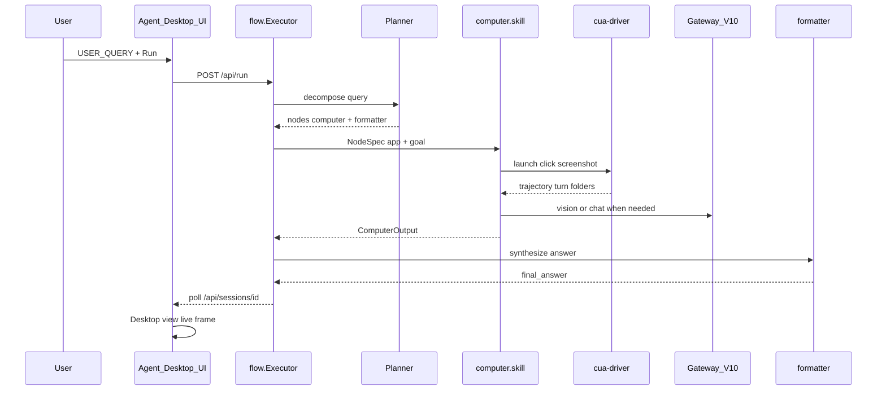
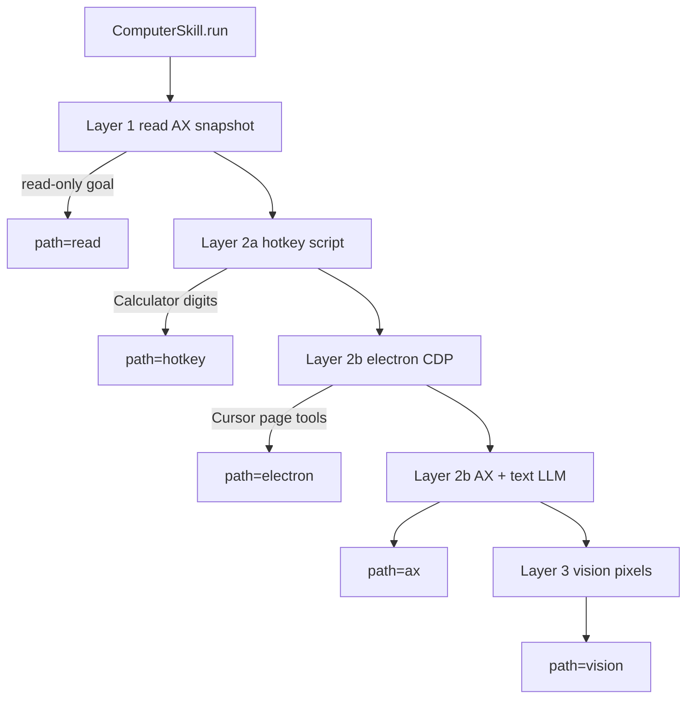
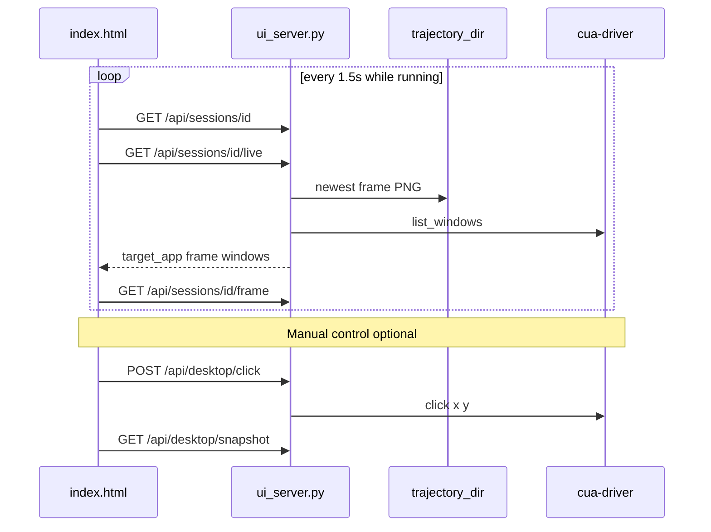
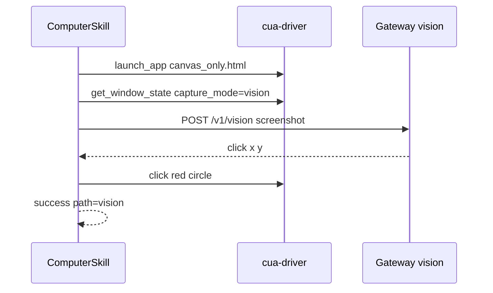
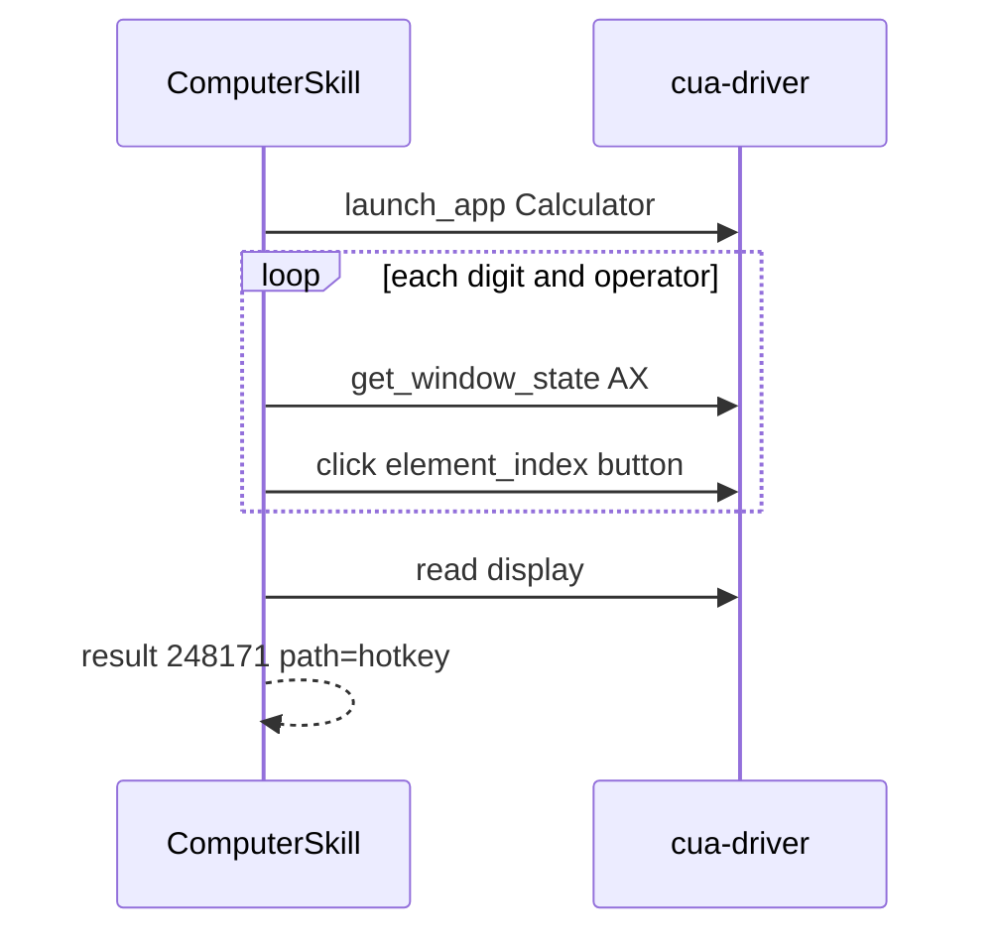

# Session 10 — Agent Desktop + Computer-Use

Desktop automation agent with a **growing-graph orchestrator** (Planner → skills → Formatter), a **five-layer computer cascade** via **cua-driver**, and a **browser UI** for submitting `USER_QUERY` and watching live desktop feedback.

| Service | Default URL | Role |
|---------|-------------|------|
| LLM Gateway V10 | `http://localhost:8110` | Chat, vision, embeddings, cost ledger |
| Agent Desktop UI | `http://localhost:8120` | Presets, run control, live screenshots |
| cua-driver | CLI / daemon | Native window control + trajectory recording |

---

## Repository layout

```
S10_Comp_Desktop/
├── code/                    # Orchestrator, computer skill, UI server
│   ├── flow.py              # Graph executor (NetworkX)
│   ├── skills.py            # Skill registry + dispatch
│   ├── ui_server.py         # FastAPI UI backend
│   ├── static/index.html    # Agent Desktop UI frontend
│   ├── computer/            # Five-layer cascade + fixtures
│   ├── cua/                 # cua-driver client + recording
│   ├── browser/             # Browser skill (web cascade)
│   ├── prompts/             # Planner, computer, formatter, …
│   └── state/sessions/      # Per-run graphs + trajectories
└── llm_gatewayV10/          # Local LLM gateway
```

---

## Architecture

### End-to-end run (UI or CLI)



### Computer skill — five-layer cascade

Layers are tried in order until one succeeds (unless `metadata.force_path` pins a layer).



| Layer | `path` value | Module | LLM? | Typical task |
|-------|--------------|--------|------|--------------|
| 1 | `read` | `layer1_read.py` | No | Read-only window state |
| 2a | `hotkey` | `layer2a_hotkey.py` | No | Calculator button clicks |
| 2b | `electron` | `layer2b_electron.py` | Chat | Cursor / VS Code via CDP |
| 2b | `ax` | `layer2b_ax.py` | Chat | AX element_index loop |
| 3 | `vision` | `layer3_vision.py` | Vision | Canvas fixture, pixel clicks |

Typed **USER_QUERY** strings are enriched before the computer skill runs (`enrich_computer_metadata` in `computer/goal_utils.py`) so Calculator, Cursor, and Canvas patterns get the right `app`, `goal`, and `electron_debugging_port` even when the Planner omits them.

### Agent Desktop UI — live + manual control



---

## Quick start

### 1. Prerequisites

```powershell
# cua-driver (once)
cd code
.\scripts\setup_cua_driver.ps1

# LLM Gateway V10
cd ..\llm_gatewayV10
.\run.ps1

# Cursor preset only — debug port 9222
cd ..\code
.\computer\scripts\launch_cursor_debug.ps1
```

### 2. Configure environment

Copy `code/.env.example` → `code/.env`:

```env
AGENT_LLM_PROVIDER=oai          # or auto for gateway failover
LLM_GATEWAY_V10_URL=http://localhost:8110
AGENT_UI_PORT=8120
# Optional: move sessions off OneDrive
# AGENT_SESSIONS_ROOT=C:\temp\agent-sessions
```

### 3. Start the UI

```powershell
cd code
.\run_ui.ps1
```

Open **http://localhost:8120**. Health pills should show Gateway, Vision, and cua-driver OK.

### 4. Run a task

- Pick a **preset** (Calculator, Canvas, Cursor), or type any desktop query in **USER_QUERY**.
- Click **Run**. Progress shows Planner → computer → Formatter.
- **Desktop view** shows target app, live screenshot, and open windows.
- Enable **Manual control** to click the screenshot (sends window-local coordinates to cua-driver).

### CLI equivalent

```powershell
cd code
.\.venv\Scripts\python.exe flow.py "Open Calculator and compute 847 times 293"
```

---

## Presets (`code/ui/presets.yaml`)

| Preset | Layer | Query (abbreviated) |
|--------|-------|-------------------|
| **Calculator** | hotkey | Open Calculator and compute 847 × 293 |
| **Canvas** | vision | Open canvas fixture, click red circle |
| **Cursor** | electron | Create `notes/s10_evidence.txt` in Cursor |

Custom text in the query box uses the **same** `POST /api/run` path as presets. The Planner decomposes the query; computer metadata is enriched from query keywords.

---

## Trajectory evidence

Every computer run calls `cua-driver start_recording`. Evidence lives under:

```
state/sessions/<session_id>/computer/trajectory_<unix_ts>/
  manifest.json
  session.json
  turn-00001/
    action.json
    screenshot.png      # or click.png
    app_state.json
  turn-00002/
    ...
  artifacts/            # vision layer only
    vision_turn_01.png
```

`ComputerOutput.trajectory_dir` in the graph node result points to this folder.

---

## Last 3 successful `trajectory_dir` (on this machine)

These are the three most recent **successful** computer-skill runs found under `code/state/sessions/` (June 2026).

### 1. Canvas vision — `ui-18086448`

| Field | Value |
|-------|--------|
| **Query** | Open the canvas fixture and click inside the red circle on the canvas. |
| **Path** | `vision` |
| **Result** | `click executed` |
| **Turns** | 2 (+ 1 artifact PNG) |
| **trajectory_dir** | `code/state/sessions/ui-18086448/computer/trajectory_1781529402` |

Full path:

```
C:\Users\Padmanabh\OneDrive\Documents\S10_Comp_Desktop\code\state\sessions\ui-18086448\computer\trajectory_1781529402
```



---

### 2. Calculator hotkey (custom query) — `ui-f9850489`

| Field | Value |
|-------|--------|
| **Query** | Open calculator and add 242 plus 2432 and return the answer |
| **Path** | `hotkey` |
| **Result** | `248171` (display matched expected arithmetic) |
| **Turns** | 10 |
| **trajectory_dir** | `code/state/sessions/ui-f9850489/computer/trajectory_1781529280` |

Full path:

```
C:\Users\Padmanabh\OneDrive\Documents\S10_Comp_Desktop\code\state\sessions\ui-f9850489\computer\trajectory_1781529280
```



---

### 3. Calculator hotkey (preset query) — `ui-10513945`

| Field | Value |
|-------|--------|
| **Query** | Open Calculator and compute 847 times 293. Return the displayed result. |
| **Path** | `hotkey` |
| **Result** | `248171` (847 × 293) |
| **Turns** | 10 |
| **trajectory_dir** | `code/state/sessions/ui-10513945/computer/trajectory_1781528971` |

Full path:

```
C:\Users\Padmanabh\OneDrive\Documents\S10_Comp_Desktop\code\state\sessions\ui-10513945\computer\trajectory_1781528971
```

**Validation smoke run** (same task, direct script, 9 turns):

```
code/state/validation/computer/trajectory_1781512941
```

---

## UI API reference

| Method | Endpoint | Purpose |
|--------|----------|---------|
| GET | `/api/presets` | Preset cards + `layer` for styling |
| GET | `/api/health` | Gateway, vision probe, cua-driver |
| POST | `/api/run` | `{ "query": "..." }` → `{ "session_id" }` |
| GET | `/api/sessions/{sid}` | Graph nodes, status, answer |
| GET | `/api/sessions/{sid}/live` | Target app, goal, frame meta, windows |
| GET | `/api/sessions/{sid}/frame` | Latest trajectory PNG |
| GET | `/api/desktop/windows` | `list_windows` via cua-driver |
| POST | `/api/desktop/click` | Manual click `{ pid, window_id, x, y }` |
| GET | `/api/desktop/snapshot` | Fresh screenshot after manual click |

---

## Testing

```powershell
cd code
.\.venv\Scripts\python.exe -m pytest tests/test_ui_server.py tests/test_computer_goals.py tests/test_persistence.py -q
.\.venv\Scripts\python.exe scripts\smoke_computer_hotkey.py
```

See also [code/COMPUTER_VALIDATION.md](code/COMPUTER_VALIDATION.md) for the three validation tasks and constraint matrix.

---

## Troubleshooting

| Symptom | Likely cause | Fix |
|---------|--------------|-----|
| `PermissionError` on `graph.json` | OneDrive file lock during atomic rename | Retry logic in `persistence.py`; set `AGENT_SESSIONS_ROOT` outside OneDrive |
| `path=vision` for Cursor query | Electron layer failed; fell through before fix | Run `launch_cursor_debug.ps1`; restart UI |
| Gateway `503` on `/v1/vision` | Gateway down or provider misconfigured | Start `llm_gatewayV10`; set `AGENT_LLM_PROVIDER=oai` |
| Canvas targets wrong window | Agent Desktop UI window captured | Vision blocklist + `canvas_only` window pick |
| Manual click no effect | No target pid/window_id | Pick window in list or wait for agent frame |

---

## Key source files

| File | Responsibility |
|------|----------------|
| [code/flow.py](code/flow.py) | Graph executor, recovery replanning |
| [code/computer/skill.py](code/computer/skill.py) | Five-layer cascade orchestration |
| [code/computer/goal_utils.py](code/computer/goal_utils.py) | Query → app/goal inference |
| [code/ui_server.py](code/ui_server.py) | REST API + live desktop payload |
| [code/static/index.html](code/static/index.html) | UI, polling, manual control |
| [code/persistence.py](code/persistence.py) | Session graphs, atomic writes |
| [code/prompts/planner.md](code/prompts/planner.md) | Planner examples for computer tasks |

---

## Related docs

- [code/COMPUTER_VALIDATION.md](code/COMPUTER_VALIDATION.md) — validation tasks, layer map, cost checks
- [llm_gatewayV10/README.md](llm_gatewayV10/README.md) — gateway setup
