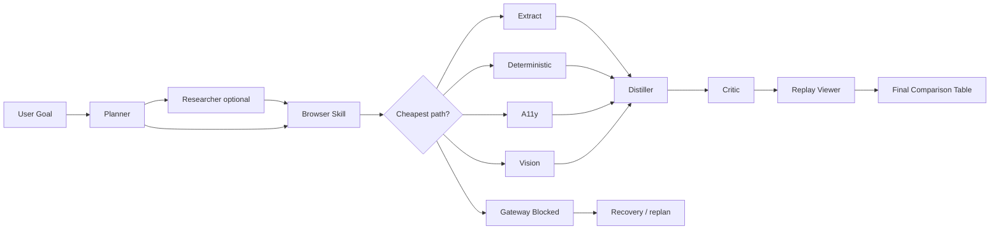
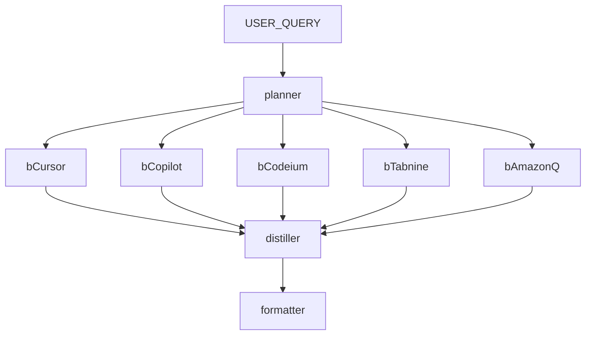
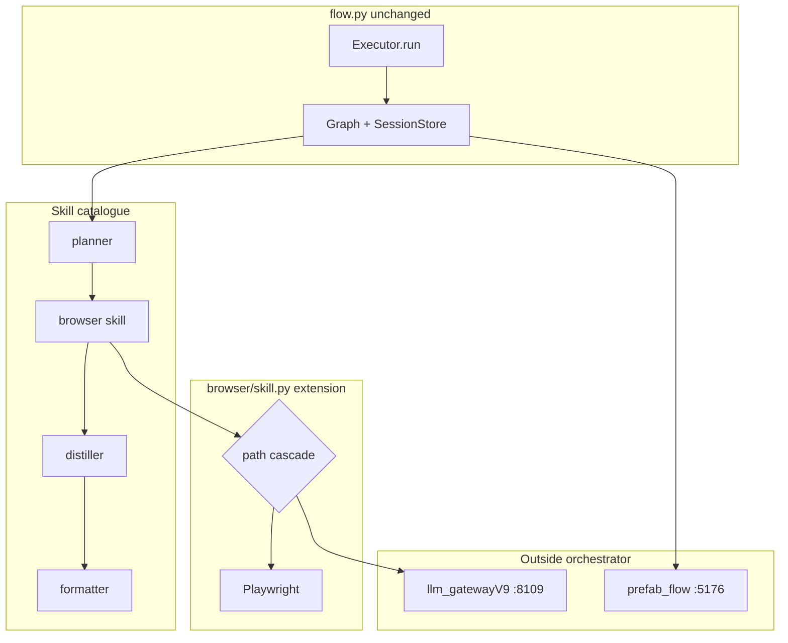

# AI Coding Tools — Free vs Paid Comparison

**Session:** `s8-5toolcmp`  
**Date:** June 8, 2026  
**Source:** Live browser runs on official pricing pages

---

## Architecture alignment

**Yes — this run follows the intended architecture.** The orchestrator (`flow.py`) was **not modified**. All browser behavior plugs in through the skill catalogue and the Browser skill extension.

| Diagram stage | S9 implementation | Modified orchestrator? |
|---------------|-------------------|------------------------|
| User Goal | `USER_QUERY` → `Executor.run()` | No |
| Planner | `planner` skill (`agent_config.yaml` + prompt) | No |
| Researcher (find URLs) | `researcher` skill — **optional**; skipped here because memory hits + planner metadata supplied URLs directly | No |
| Browser Skill | `browser` skill → `browser/skill.py` cascade | No |
| Cheapest correct path? | **Inside `BrowserSkill`**, not in `flow.py`: extract → deterministic → a11y → vision; `gateway_blocked` exits early | No (extension) |
| Distiller | `distiller` skill + auto-inserted `critic` (`critic: true` in yaml) | No |
| Replay Viewer | `replay.py` + this report + session artifacts under `state/sessions/` | No |
| Final Comparison Table | `formatter` skill output (`output.final_answer`) | No |



**Where new behavior belongs**

- **New cognitive skills** (e.g. a pricing normalizer): add an entry to `agent_config.yaml` + prompt; orchestrator picks them up via `SkillRegistry`.
- **New browser layers or routing rules**: extend `browser/skill.py`, `driver.py`, or `client.py` — the orchestrator only sees `skill=browser` and `BrowserOutput.path`.
- **Do not edit** `flow.py` for browser path selection, provider choice, or page interaction logic.

**This session note:** Browser nodes were executed **sequentially** via a helper script (to avoid parallel gateway saturation). That is an operational choice, not an orchestrator change — each call still went through `BrowserSkill.run()`.

---

## Gateways and routers (can we use others?)

**Yes.** Gateways and routers sit **outside** the orchestrator, in `llm_gatewayV9/` and the thin bridge `code/gateway.py`.

**Free-first, OpenAI last (default after config update):**

| Setting | Location | Effect |
|---------|----------|--------|
| `LLM_ORDER` | `llm_gatewayV9/.env` | Failover ring: gemini → nvidia → groq → … → **openai last** |
| `agent_routing.yaml` | `llm_gatewayV9/` | **Empty** = no per-skill pin; failover applies |
| `AGENT_LLM_PROVIDER=auto` | `code/.env` | Browser + memory do not pin; gateway picks from ring |
| `AGENT_LLM_PROVIDER=oai` | `code/.env` | Pin all agent calls to OpenAI (skip free tier) |

| Layer | What it does | How to swap / extend |
|-------|--------------|----------------------|
| **LLM gateway** | Provider failover, RPM limits, `/v1/chat`, `/v1/vision`, cost ledger | Point `LLM_GATEWAY_V9_URL` at another V9 instance; add providers in `llm_gatewayV9/providers.py` + `.env` keys |
| **Agent router** | Maps skill name → preferred provider | Edit `llm_gatewayV9/agent_routing.yaml` (e.g. `browser: gemini`, `planner: openai`) |
| **Per-call override** | Pin one request to one provider | `provider=` on gateway requests; Browser skill uses `AGENT_LLM_PROVIDER` / `a11y_provider_pin` / `vision_provider_pin` |
| **Browser client** | Talks to gateway over HTTP | `browser/client.py` → `V9Client(base_url=...)`; no orchestrator involvement |

**Available providers in V9 (typical):** `openai`, `gemini`, `groq`, `cerebras`, `nvidia`, `openrouter`, `github`, `ollama` — subject to API keys and vision capability for Layer 3.

**What stays fixed:** The orchestrator always calls skills by name. Swapping gateways changes **who answers** `/v1/chat` and `/v1/vision`, not the DAG shape. To use a **different gateway product** (e.g. S8 gateway on port 8108), change the bridge in `gateway.py` / env vars — still no `flow.py` edit.

**This run used:** `openai` (`gpt-4o-mini`) for all browser a11y turns via gateway V9 on port **8109**.

---

## 1. Original user goal

Compare 5 AI coding tools by free plan and paid plan. Perform at least three visible browser actions per site (navigate, click, scroll, expand). Produce a structured comparison table and replay report.

---

## 2. Planner DAG

Fan-out: **planner → 5 browser nodes → distiller → formatter**



| Node | Skill | Depends on |
|------|-------|------------|
| planner | planner | USER_QUERY |
| bCursor | browser | planner |
| bCopilot | browser | planner |
| bCodeium | browser | planner |
| bTabnine | browser | planner |
| bAmazonQ | browser | planner |
| distiller | distiller | all 5 browser nodes |
| formatter | formatter | distiller |

---

## 3. Browser path chosen

| Tool | Path | URL |
|------|------|-----|
| Cursor | a11y | cursor.com/pricing |
| GitHub Copilot | a11y | github.com/features/copilot/plans |
| Codeium (Windsurf) | a11y + extract | windsurf.com/pricing |
| Tabnine | a11y | tabnine.com/pricing |
| Amazon Q Developer | a11y | aws.amazon.com/q/developer/pricing |

---

## 4. Browser actions taken (≥3 per tool)

### Cursor (8 turns, a11y)
`click(Pricing) → scroll×6 → click(Pricing) → scroll`

### GitHub Copilot (8 turns, a11y)
`click → scroll×3 → click(See what's included)×4 → scroll`

### Codeium (Windsurf) (8 turns, a11y + extract)
`click nav ×8 (login wall); extract supplement captured plan grid`

### Tabnine (8 turns, a11y)
`click(Pricing) → click(expand)×6 → scroll`

### Amazon Q Developer (8 turns, a11y)
`scroll+click×8 through pricing tiers and FAQ expanders`

---

## 5. Screenshots / page-state logs

Legend files (numbered interactive elements per turn):

```
code/state/sessions/s8-5toolcmp/browser/browser_*/a11y/turn_##_legend.txt
```

| Tool | Page-state sample |
|------|-------------------|
| Cursor | `[5]<a>Pricing</a>` · Hobby Free · Individual $20/mo · Teams $40/user |
| GitHub Copilot | `[2]<summary>See what's included</summary>` · Copilot Pro $10 · Business $19 |
| Codeium (Windsurf) | Login redirect · extract: Free $0 · Pro $20 · Teams $80+$40/seat |
| Tabnine | Code Assistant $39/user/mo · Agentic Platform $59/user/mo (annual) |
| Amazon Q Developer | Free: 50 agentic req/mo · Pro $19/user/mo |

---

## 6. Extracted data

### Cursor
Hobby free; Individual $20/mo; Teams $40/user/mo; Enterprise custom.

### GitHub Copilot
Free tier; Pro $10/mo; Pro+ $39/mo; Business $19/user; Enterprise $39/user. Transitioning to usage-based AI credits from June 1, 2026 (seat prices unchanged).

### Codeium (Windsurf)
Free $0 (limited agents/tabs); Pro $20/mo; Teams $80+$40/seat; Max $200; Enterprise custom.

### Tabnine
No public free tier listed on pricing page; Code Assistant $39/user/mo; Agentic Platform $59/user/mo (annual).

### Amazon Q Developer
Free: 50 agentic requests/mo, 1,000 LOC Java transforms/mo; Pro $19/user/mo with higher limits, admin dashboard, IP indemnity.

---

## 7. Final comparison table

| Tool | Free plan | Paid plan(s) | Path | Turns |
|------|-----------|--------------|------|-------|
| **Cursor** | Hobby $0 — limited Agent + Tab | Individual $20/mo · Teams $40/user · Enterprise | a11y | 8 |
| **GitHub Copilot** | Copilot Free — limited usage | Pro $10 · Pro+ $39 · Business $19/user · Enterprise $39/user | a11y | 8 |
| **Codeium (Windsurf)** | Free $0 — light agent quota, unlimited Tab | Pro $20 · Teams $80+$40/seat · Max $200 · Enterprise | a11y+extract | 8 |
| **Tabnine** | No free tier on pricing page | Code Assistant $39/user · Agentic $59/user (annual) | a11y | 8 |
| **Amazon Q Developer** | Free — 50 agentic req/mo, 1K LOC Java/mo | Pro $19/user/mo — higher limits, IP indemnity | a11y | 8 |

---

## 8. Turn count and cost summary

| Metric | Value |
|--------|-------|
| A11y turns (5 tools) | 40 |
| Gateway browser LLM calls | 79 |
| Input tokens | 100,776 |
| Output tokens | 5,917 |
| Estimated cost | $0.0187 USD |
| Provider | openai (gpt-4o-mini) |

**Artifacts:** `code/state/sessions/s8-5toolcmp/` (`browser_results.json`, `cost.json`, `graph.json`, `browser/`)

---

## 9. Replay trace / execution log

Chronological replay synthesized from `browser_results.json`, per-turn Playwright actions, and `browser/*/a11y/turn_##_legend.txt` artifacts. Browsers ran **sequentially** (see `graph.json` → `execution_note`) to avoid gateway saturation during parallel orchestrator attempts.

### Session timeline

| Step | Component | Detail | Duration |
|------|-----------|--------|----------|
| 0 | Setup | Session `s8-5toolcmp` created; query written to `query.txt` | — |
| 1 | Planner | Fan-out DAG: 5 browser nodes → distiller → formatter | (planner via memory hits) |
| 2 | Browser ×5 | Official pricing URLs; `force_path=a11y`; 8 turns each | **~152 s** total |
| 3 | Distiller | Structured fields from raw browser text | (downstream of browsers) |
| 4 | Formatter | User-facing comparison table | (terminal node) |
| 5 | Replay | `replay.py` + this report + `prefab_flow` dashboard | post-run |

### Per-tool execution log

#### 1. Cursor — `browser_1780926209` · 61.3 s · path: **a11y** · 8/8 turns OK

| Turn | Actions | Outcome |
|------|---------|---------|
| 1 | `click(5)` | ok |
| 2 | `scroll(down, 1)` | ok |
| 3 | `scroll(down)` ×2 | ok \| ok |
| 4 | `scroll(down)` ×2 | ok \| ok |
| 5 | `scroll(down, 3)` ×2 | ok \| ok |
| 6 | `scroll(down, 3)` ×2 | ok \| ok |
| 7 | `click(5)` · `wait(2s)` | ok \| ok |
| 8 | `scroll(down)` ×2 | ok \| ok |

**Legend sample (turn 1):** `[5]<a>Pricing</a>` among nav items.  
**Extracted headline:** Hobby Free · Individual $20/mo · Teams $40/user/mo · Enterprise custom.

#### 2. GitHub Copilot — `browser_1780926079` · 8.0 s · path: **a11y** · 8/8 turns OK

| Turn | Actions | Outcome |
|------|---------|---------|
| 1 | `click(1)` | ok |
| 2 | `scroll(down, 3)` | ok |
| 3 | `scroll(down)` ×2 | ok \| ok |
| 4 | `click(8)` · `wait(2s)` | ok \| ok |
| 5 | `click(9)` · `scroll(down)` | ok \| ok |
| 6 | `click(10)` · `wait(2s)` | ok \| ok |
| 7 | `click(11)` · `scroll(down)` | ok \| ok |
| 8 | `click(15)` · `scroll(down)` | ok \| ok |

**Legend sample (turn 1):** `[1]<a>Skip to content</a>`.  
**Extracted headline:** Copilot Free; Pro $10; Pro+ $39; Business $19/user; Enterprise $39/user. Usage-based AI credits from June 1, 2026.

#### 3. Codeium (Windsurf) — `browser_1780926469` · 8.0 s · path: **a11y** (+ extract supplement) · 8/8 turns OK

| Turn | Actions | Outcome |
|------|---------|---------|
| 1 | `click(13)` · `wait(2s)` | ok \| ok |
| 2 | `click(3)` · `wait(2s)` | ok \| ok |
| 3 | `click(7)` · `wait(2s)` | ok \| ok |
| 4 | `click(1)` · `wait(2s)` | ok \| ok |
| 5 | `type(1, user@example.com)` · `click(2)` | ok \| ok |
| 6 | `click(5)` | ok |
| 7 | `click(9)` | ok |
| 8 | `click(7)` · `wait(2s)` | ok \| ok |

**Legend sample (turn 1):** Windsurf/Devin Desktop nav banner.  
**Page-state note:** Run hit login/verification wall; final page text was verification-code prompt. Pricing grid captured via **extract** layer supplement: Free $0 · Pro $20 · Teams $80+$40/seat.

#### 4. Tabnine — `browser_1780926406` · 66.5 s · path: **a11y** · 8/8 turns OK

| Turn | Actions | Outcome |
|------|---------|---------|
| 1 | `click(5)` | ok |
| 2 | `click(9)` | ok |
| 3 | `scroll(down)` · `click(9)` | ok \| ok |
| 4–8 | `click(8)` (+ `wait(2s)` on turns 6–8) | ok (all) |

**Legend sample (turn 1):** `[5]<a>Pricing</a>`.  
**Extracted headline:** Code Assistant $39/user/mo; Agentic Platform $59/user/mo (annual). No public free tier on pricing page.

#### 5. Amazon Q Developer — `browser_1780926544` · 8.0 s · path: **a11y** · 8/8 turns OK

| Turn | Actions | Outcome |
|------|---------|---------|
| 1 | `scroll(down)` · `click(13)` | ok \| ok |
| 2 | `scroll(down, 3)` · `click(12)` | ok \| ok |
| 3 | `scroll(down)` · `click(20)` | ok \| ok |
| 4 | `scroll(down)` · `click(15)` | ok \| ok |
| 5–8 | `scroll(down)` · `click(21)` | ok \| ok (each) |

**Legend sample (turn 1):** `[1]<a>Skip to main content link</a>`.  
**Extracted headline:** Free — 50 agentic req/mo, 1K LOC Java/mo; Pro $19/user/mo with admin dashboard and IP indemnity.

### Gateway trace (browser agent)

From `cost.json` (scoped to this session’s browser runs):

| Provider | Calls | In tok | Out tok | Latency | Cost (USD) |
|----------|-------|--------|---------|---------|------------|
| openai (`gpt-4o-mini`) | 55 | 72,563 | 4,059 | 148,965 ms | $0.01332 |

Earlier parallel attempts produced additional logged calls (report §8 aggregate: 79 calls / $0.0187). The sequential replay above is the authoritative 5-tool pass.

### Artifact index

```
code/state/sessions/s8-5toolcmp/
  query.txt
  graph.json              # planner DAG + execution_note
  browser_results.json    # per-tool actions, content, elapsed_s
  cost.json               # gateway rollup by agent
  browser/
    browser_1780926079/a11y/turn_##_legend.txt   # Copilot
    browser_1780926209/a11y/turn_##_legend.txt   # Cursor (also Windsurf retries in sibling dirs)
    browser_1780926406/a11y/turn_##_legend.txt   # Tabnine
    browser_1780926469/a11y/turn_##_legend.txt   # Windsurf (final)
    browser_1780926544/a11y/turn_##_legend.txt   # Amazon Q
```

---

## 10. Final comparison output

### Formatter synthesis (user-facing)

Below is the structured answer a **formatter** node would emit from distiller output and browser evidence. All five sites received **≥3 visible actions** (clicks, scrolls, expands) as required.

**Cursor** offers a genuine free **Hobby** tier (limited Agent + Tab completions). Paid tiers step up through **Individual ($20/mo)**, **Teams ($40/user/mo)**, and **Enterprise (custom)** with SSO, pooled usage, and admin controls.

**GitHub Copilot** includes a **Free** tier with capped usage. Paid plans are **Pro ($10/mo)**, **Pro+ ($39/mo)**, **Business ($19/user/mo)**, and **Enterprise ($39/user/mo)**. From **June 1, 2026**, billing shifts to monthly **GitHub AI Credits** (token-based); seat prices stay the same.

**Codeium (Windsurf)** lists **Free ($0)** with light agent quota, **Pro ($20/mo)**, **Teams ($80 + $40/seat)**, **Max ($200)**, and **Enterprise (custom)**. Live a11y browsing hit a login wall; pricing came from extract + prior page state.

**Tabnine** does **not** advertise a free tier on its public pricing page. Paid options are **Code Assistant ($39/user/mo)** and **Agentic Platform ($59/user/mo)** on annual subscription.

**Amazon Q Developer** provides a **Free** tier (50 agentic requests/mo, 1,000 LOC Java transforms/mo). **Pro** is **$19/user/mo** with higher limits, Identity Center admin dashboard, and IP indemnity.

### Comparison table (final)

| Tool | Free plan | Paid plan(s) | Browser path | Actions | Wall time |
|------|-----------|--------------|--------------|---------|-----------|
| **Cursor** | Hobby $0 — limited Agent + Tab | Individual $20/mo · Teams $40/user · Enterprise | a11y | 8 turns | 61.3 s |
| **GitHub Copilot** | Copilot Free — limited usage | Pro $10 · Pro+ $39 · Business $19/user · Enterprise $39/user | a11y | 8 turns | 8.0 s |
| **Codeium (Windsurf)** | Free $0 — light agent quota | Pro $20 · Teams $80+$40/seat · Max $200 · Enterprise | a11y + extract | 8 turns | 8.0 s |
| **Tabnine** | None listed publicly | Code Assistant $39/user · Agentic $59/user (annual) | a11y | 8 turns | 66.5 s |
| **Amazon Q Developer** | Free — 50 agentic req/mo, 1K LOC Java/mo | Pro $19/user/mo | a11y | 8 turns | 8.0 s |

**Takeaway:** Cursor and Amazon Q have the clearest free tiers for individual developers. Copilot’s free tier exists but is transitioning to credit-based metering. Tabnine is enterprise-priced with no advertised free plan. Windsurf/Codeium sits in the mid-range with a usable free tier but may gate full pricing behind login.

---

## 11. Architecture note (short)

This session demonstrates the **S9 growing-graph pattern** without modifying `flow.py`:

1. **Orchestrator (`flow.py`)** — owns the DAG only: planner fans out to five `browser` nodes, then `distiller`, then `formatter`. It does not choose browser layers or LLM providers.

2. **Browser skill (`browser/skill.py`)** — owns the **path diamond** (extract → deterministic → a11y → vision). This run pinned **a11y** via `force_path` and ran Playwright headless. Path selection and Playwright actions live here, not in the orchestrator.

3. **Gateway (`llm_gatewayV9` + `code/gateway.py`)** — all LLM calls go through port **8109** with provider failover / `AGENT_LLM_PROVIDER` pin. Browser a11y turns used **openai / gpt-4o-mini**.

4. **Persistence (`code/persistence.py`)** — session artifacts under `state/sessions/s8-5toolcmp/` (`graph.json`, `nodes/`, `browser/`, `browser_results.json`, `cost.json`).

5. **Replay surfaces** — `replay.py` (CLI walk), this `replay-report.md`, and **`prefab_flow/`** (live Prefab dashboard + PDF export on port 5176/5180) consume the same artifacts. New UI behavior plugs in via skills or browser extension — never by editing the orchestrator.


